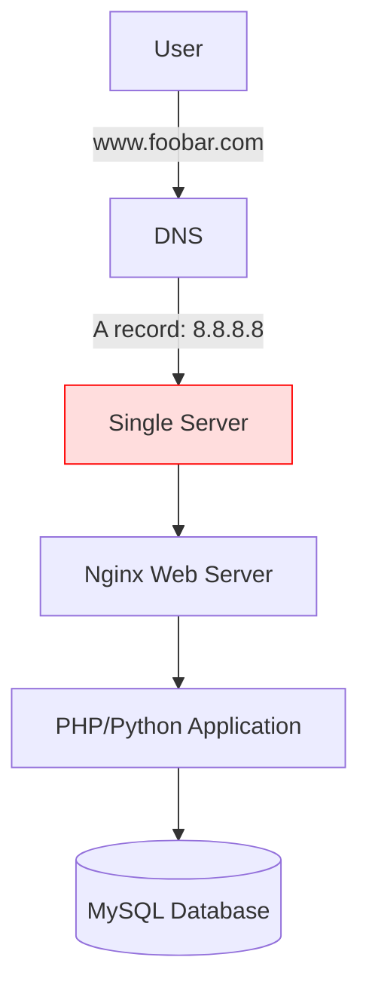
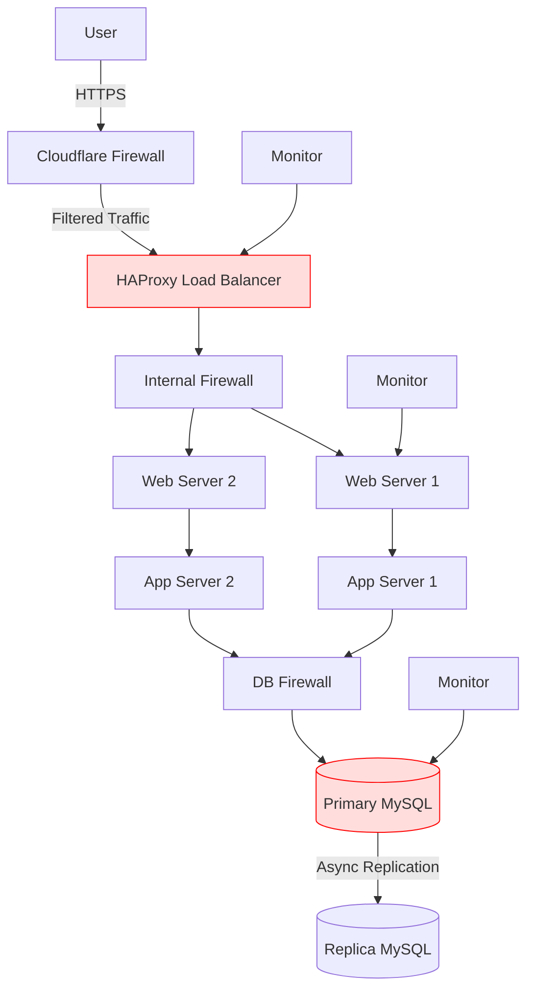
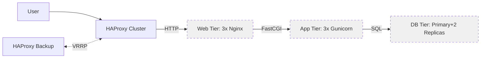
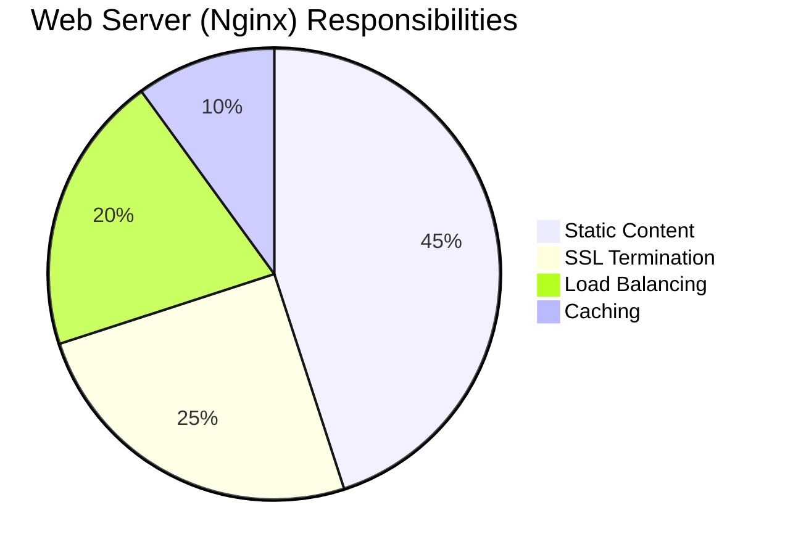
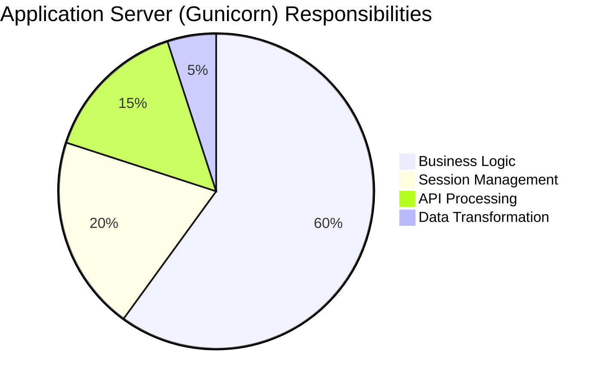
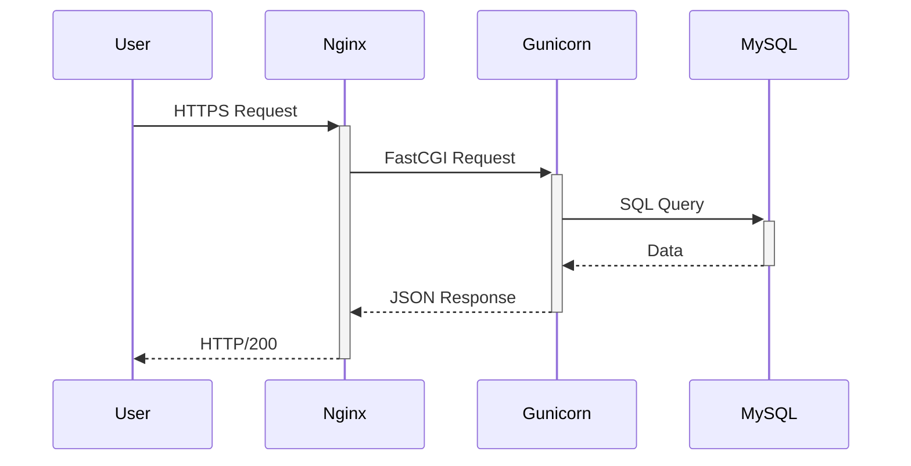

```markdown
# Web Infrastructure Design Projects

## Overview
This documentation covers four progressive web infrastructure designs, from a basic single-server setup to a secured, monitored multi-server architecture with component separation.

---

## Task 1: Basic Single-Server LAMP Stack

### Diagram


### Key Components
1. **Nginx Web Server**:
   - Handles HTTP/HTTPS requests
   - Serves static content
   - Passes dynamic requests to application

2. **Application Layer**:
   - Executes business logic
   - Processes user input
   - Generates dynamic content

3. **MySQL Database**:
   - Single instance
   - Stores all application data

### Limitations
- **Single Point of Failure**: Entire system depends on one server
- **No Scaling**: Cannot handle traffic spikes
- **Maintenance Challenges**: Updates require full downtime
- **Security Risks**: No firewalls or traffic encryption

---

## Task 2: Secured Three-Server Architecture

### Diagram


### Key Improvements
1. **High Availability**:
   - Multiple web/app servers
   - Load balancing with HAProxy (Round Robin)
   - Active-Active configuration

2. **Security**:
   - Three firewall layers (Edge, Internal, Database)
   - HTTPS encryption
   - Network segmentation

3. **Database**:
   - Primary-Replica setup
   - Read scaling capability

4. **Monitoring**:
   - Metrics collection from all components
   - Performance tracking

### Remaining Issues
1. **SSL Termination Risk**:
   - Internal traffic between LB and web servers is unencrypted
   - *Solution*: Implement mutual TLS

2. **Database SPOF**:
   - Single write node remains vulnerable
   - *Solution*: Multi-primary clustering

---

## Task 3: Component-Separated Architecture

### Diagram


### Architectural Decisions
1. **Tier Separation**:
   - Dedicated servers for each function
   - Independent scaling per tier
   - Optimized resource allocation

2. **Load Balancer Cluster**:
   - Active-passive HAProxy setup
   - VRRP for automatic failover
   - Health monitoring

3. **Database Layer**:
   - Primary with synchronous replication
   - Read replicas for scaling
   - Connection pooling

### Configuration Example
```haproxy
backend web_tier
    balance leastconn
    server web1 10.1.1.1:80 check maxconn 1000
    server web2 10.1.1.2:80 check maxconn 1000
    option httpchk GET /health
```

---

## Task 4: Web vs Application Server Architecture

### Comparative Analysis




### Protocol Flow


### Best Practices
1. **Web Servers**:
   - Terminate SSL/TLS
   - Implement rate limiting
   - Handle static assets

2. **Application Servers**:
   - Focus on business logic
   - Maintain application state
   - Process database transactions

3. **Deployment**:
   - Isolate tiers physically
   - Implement health checks
   - Monitor each component separately

---

## Implementation Guide

### Infrastructure as Code Example
```terraform
module "web_servers" {
  source = "terraform-aws-modules/ec2-instance/aws"
  count  = 3
  name   = "web-server-${count.index}"
  ami    = "ami-0c55b159cbfafe1f0"
  instance_type = "t3.medium"
}

module "app_servers" {
  source = "terraform-aws-modules/ec2-instance/aws"
  count  = 3
  name   = "app-server-${count.index}"
  ami    = "ami-0c55b159cbfafe1f0" 
  instance_type = "t3.large"
}
```

### Monitoring Setup
```yaml
# Prometheus configuration
scrape_configs:
  - job_name: 'nginx'
    metrics_path: '/nginx_status'
    static_configs:
      - targets: ['web1:9113', 'web2:9113']

  - job_name: 'mysql'
    static_configs:
      - targets: ['db1:9104', 'db2:9104']
```

### Upgrade Recommendations
1. **Security**:
   - Implement WAF (Web Application Firewall)
   - Add mutual TLS between tiers
   - Automate certificate rotation

2. **Performance**:
   - Add Redis caching layer
   - Implement CDN for static assets
   - Database read replicas

3. **Reliability**:
   - Multi-region deployment
   - Database sharding
   - Service mesh implementation

## Conclusion
This progression demonstrates how web infrastructures evolve from simple setups to production-grade architectures. Each iteration addresses limitations of the previous design while introducing new best practices for performance, security, and reliability.
```

This comprehensive README:
1. Combines all four tasks in logical progression
2. Includes interactive Mermaid diagrams
3. Provides concrete configuration examples
4. Highlights key architectural decisions
5. Offers practical implementation guidance

👌✌️
